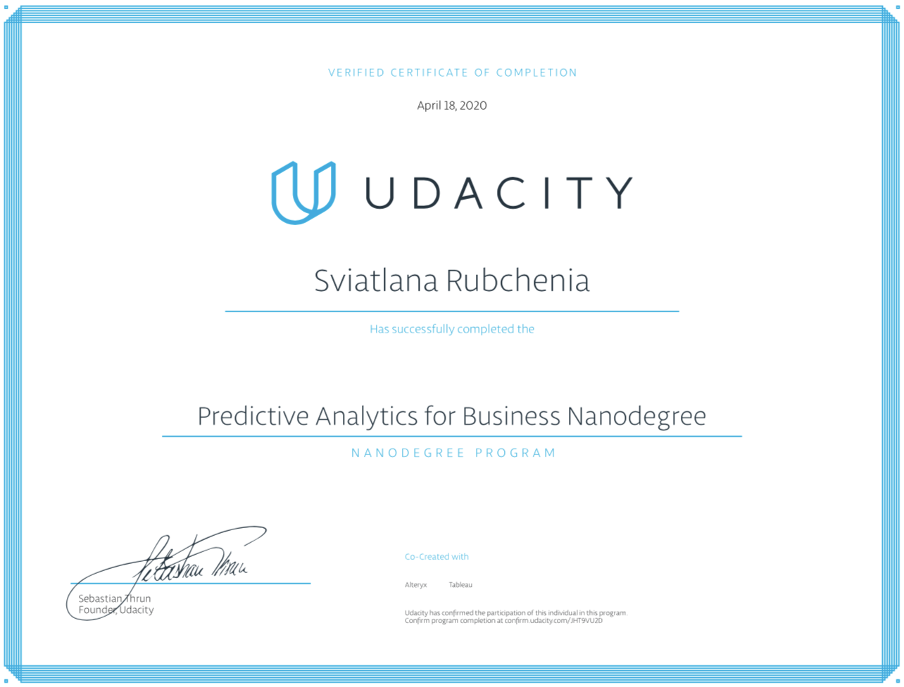

# Udacity Predictive Analytics for Business Nanodegree

### Part 1: Problem Solving with Analytics
A scientific approach to solving problems with data, a foundational skill for data driven decisions in a business context. 
- Project: [Predicting Diamond Prices](https://github.com/lllana/Udacity_Problem_Solving_with_Analytics)
- Project: [Predicting Catalog Demand](https://github.com/lllana/Udacity_Project2_Problem_Solving_with_Analytics)

### Part 2: Data Wrangling
Understanding the most common data types, the various sources of data. Making adjustments to dirty data to prepare a dataset. Identifying and adjusting for outliers. Writing queries to extract and analyze data from a relational database.
- Project: [Create an Analytical Dataset](https://github.com/lllana/Udacity_Project2_Data-Wrangling)

### Part 3: Classification Models
Using classification models, such as logistic regression, decision tree, forest, and boosted, to make predictions of binary and non-binary outcomes.
- Project: [Predicting Default Risk](https://github.com/lllana/Udacity_Project_Classification_Models)

### Part 4: A/B Testing 
Understanding the fundamentals of A/B testing, including experimental design, variable selection, and analyzing and interpreting results.
- Project: [Analyzing a Market Test](https://github.com/lllana/Udacity_Analyzing_a_Market_Test)

### Part 6: Time Series Forecasting
Understanding trend, seasonal, and cyclical behavior of time series data. Use time series decomposition plots. Build ETS and ARIMA models.
- Project: [Time Series Forecasting](https://github.com/lllana/Udacity_Time_Series_Forecasting)

### Part 6: Segmantation and Clastering
Preparing data, selecting variables for clustering. Building and applying K-centroid cluster model. Data Visualization.  
- Project: Combining predictive techniques and delivering results.

https://confirm.udacity.com/JHT9VU2D

